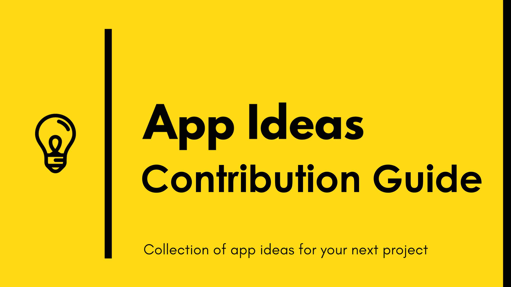

## Contribution Guide

Hello fellow contributor! Thanks for being interested in contributing to this project! \
Please before you make any new contributions make sure that your contribution follows this guide.

This guide will help us ensure that you have a simple and effective way to contribute to this project.

-   If you want to propose a new App Idea, please use the [Example Guide](./Example%20Guide.md) as a base template.
-   Before creating a Pull Request, please make sure that your suggestion is not already added to the project. You can submit an update if you believe it improves an existing idea.
-   Make sure you check your spelling and grammar.
-   Create individual PR for each suggestion.

Thank you for spending your time to improve this project! ^\_^
