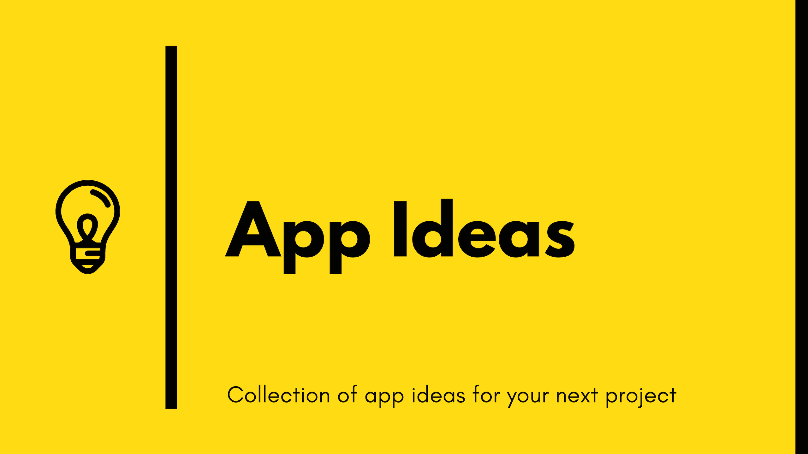

## :ledger: App Ideas Collection

Have you ever wanted to build something but you had no idea what to do? Just as
authors sometimes have "writers block" it's also true for developers. This list is intended to solve this issue once and for all! 👍

These applications are:

-   great to improve your coding skills :muscle:;
-   great to experiment with new technologies 🆕;
-   great to be added in your portfolio to impress your next employer/client :file_folder:;
-   great to be used as examples in tutorials (articles or videos) :page_with_curl:;
-   easy to complete and also easily extendable with new features :ok_hand:;

This is not just a simple list of projects, but a collection that describes each project in enough detail so you can develop it from the ground up!

Each project has the following **features**:

1. A clear and descriptive objective;
2. A list of _User Stories_ which should be implemented (these stories act more as a guideline than a forced list of _To-Do's_. Feel free to add your own stories if you want);
3. A list of bonus features that not only improve the base project, but also your skills at the same time (these are optional and should be attempted only after you have completed the required user stories)
4. All the resources and links to help you find what you need to complete the project

## Projects

Projects are divided into three tiers based on the knowledge and experience
required to complete them.

| Tier | Developer Profile                                                                                                                                                |
| :--: | ---------------------------------------------------------------------------------------------------------------------------------------------------------------- |
|  1   | Developers in the early stages of their learning journey. Those who are typically focused on creating user-facing applications.                                  |
|  2   | Developers at an intermediate stage of learning and experience. They are comfortable in UI/UX, using development tools, and building apps that use API services. |
|  3   | Developers who have all of the above, and are learning more advanced techniques like implementing backend applications and database services.                    |

🌟 - New Project

### Tier-1: Beginner Projects

| Name                                                                   | Short Description                                         | Tier       |
| ---------------------------------------------------------------------- | --------------------------------------------------------- | ---------- |
| [Bin2Dec](./Projects/Bin2Dec-App.md)                                   | Binary-to-Decimal number converter                        | 1-Beginner |
| [Border Radius Previewer](./Projects/Border-Radius-Previewer.md)       | Preview how CSS3 border-radius values affect an element   | 1-Beginner |
| [🌟Calculator](./Projects/Calculator-App.md)                           | Calculator                                                | 1-Beginner |
| [Christmas Lights](./Projects/Christmas-Lights-App.md)                 | Simulate a string of Christmas lights                     | 1-Beginner |
| [Cause Effect App](./Projects/Cause-Effect-App.md)                     | Click list item to display item details                   | 1-Beginner |
| [Color Cycle](./Projects/Color-Cycle-App.md)                           | Cycle a color value through incremental changes           | 1-Beginner |
| [🌟Countdown Timer](./Projects/Countdown-Timer-App.md)                   | Event Countdown timer                                     | 1-Beginner |
| [CSV2JSON App](./Projects/CSV2JSON-App.md)                             | CSV to JSON converter                                     | 1-Beginner |
| [🌟Dynamic CSS Variables](./Projects/Dynamic-CSSVar-app.md)              | Dynamically change CSS variable settings               | 1-Beginner |
| [Flip Image](./Projects/Flip-Image-App.md)                             | Change the orientation of images across two axes          | 1-Beginner |
| [🌟GitHub Status](./Projects/GitHub-Status-App.md)                       | Display Current GitHub Status                       | 1-Beginner |
| [JSON2CSV App](./Projects/JSON2CSV-App.md)                             | JSON to CSV converter                                     | 1-Beginner |
| [🌟Key Value](./Projects/Key-Value-App.md)                               | Keyboard Event Values                                     | 1-Beginner |
| [Lorem Ipsum Generator](./Projects/Lorem-Ipsum-Generator.md)           | Generate lorem ipsum placeholder text                   | 1-Beginner |
| [Notes App](./Projects/Notes-App.md)                                   | Create an online note pad                                | 1-Beginner |
| [Pomodoro Clock](./Projects/Pomodoro-Clock.md)                         | Task timer to aid personal productivity                   | 1-Beginner |
| [:star2: Product Landing Page](./Projects/Product-Landing-Page.md)     | Showcase product details for possible buyers              | 1-Beginner |
| [Quiz App](./Projects/Quiz-App.md)                                     | Test your knowledge by answering questions                | 1-Beginner |
| [🌟Recipe App](./Projects/Recipe-App.md)                               | Recipe                                                    | 1-Beginner |
| [Roman to Decimal Converter](./Projects/Roman-to-Decimal-Converter.md) | Convert Roman to Decimal numbers                    | 1-Beginner |
| [Slider Design](./Projects/Slider-Design.md)                           | Display images using a slider control                     | 1-Beginner |
| [:star2: Stopwatch App](./Projects/Stopwatch-App.md)                   | Count time spent on activities                            | 1-Beginner |
| [TrueOrFalse](./Projects/True-or-False-App.md)                         | Identify the result of a conditional comparison           | 1-Beginner |
| [Wind Chill](./Projects/Windchill-App.md)                              | Calculate the windchill factor from an actual temperature | 1-Beginner |
| [🌟Word Frequency](./Projects/Word-Frequency-App.md)                    | Calculate word frequency in a block of text          | 1-Beginner |

### Tier-2: Intermediate Projects

| Name                                                               | Short Description                                  | Tier           |
| ------------------------------------------------------------------ | -------------------------------------------------- | -------------- |
| [🌟Bit Masks](./Projects/Bit-Masks-App.md)                         | Using Bit Masks for Conditions                  | 2-Intermediate |
| [Book Finder App](./Projects/Book-Finder-App.md)                   | Search for books by multiple criteria              | 2-Intermediate |
| [Card Memory Game](./Projects/Card-Memory-Game.md)                 | Memorize and match hidden images                   | 2-Intermediate |
| [🌟Drawing App](./Projects/Drawing-App.md)                         | Create digital artwork on the web                  | 2-Intermediate |
| [🌟Emoji Translator App](./Projects/Emoji-Translator-App.md)       | Translate sentences into Emoji                     | 2-Intermediate |
| [Flashcards App](./Projects/FlashCards-App.md)                     | Review and test your knowledge through Flash Cards | 2-Intermediate |
| [HighStriker Game](./Projects/HighStriker-Game.md)                 | Highstriker strongman carnival game                | 2-Intermediate |
| [Markdown Previewer](./Projects/Markdown-Previewer.md)             | Preview text formatted in GitHub flavored markdown | 2-Intermediate |
| [Markdown Table Generator](./Projects/Markdown-Table-Generator.md) | Convert a table into Markdown-formatted text       | 2-Intermediate |
| [🌟Meme Generator App](./Projects/Meme-Generator-App.md)           | Create custom memes                                | 2-Intermediate |
| [🌟Podcast Directory](./Projects/Podcast-Directory-App.md)         | Directory of favorite podcasts                     | 2-Intermediate |
| [Regular Expression Helper](./Projects/RegExp-Helper-App.md)       | Test Regular Expressions                           | 2-Intermediate |
| [🌟Simple Online Store](./Projects/Simple-Online-Store.md)         | Simple Online Store                                | 2-Intermediate |
| [Sports Bracket Generator](./Projects/Sports-Bracket-Generator.md) | Generate a sports bracket diagram                  | 2-Intermediate |
| [String Art](./Projects/String-Art.md)                             | An animation of moving, colored strings            | 2-Intermediate |
| [Timezone Slackbot](./Projects/Timezone-Slackbot.md)               | Display Team Timezones                             | 2-Intermediate |
| [To-Do App](./Projects/To-Do-App.md)                               | Manage personal to-do tasks                        | 2-Intermediate |
| [🌟Typing Practice](./Projects/Typing-Practice-App.md)             | Typing Practice                                    | 2-Intermediate |

### Tier-3: Advanced Projects

| Name                                                           | Short Description                                    | Tier       |
| -------------------------------------------------------------- | ---------------------------------------------------- | ---------- |
| [Battleship Bot](./Projects/Battleship-Bot.md)                 | Create a Discord bot that plays Battleship           | 3-Advanced |
| [Battleship Game Engine](./Projects/Battleship-Game-Engine.md) | Create a callable engine to play the Battleship game | 3-Advanced |
| [🌟Bug Race Game](./Projects/Bug-Race-Game.md)                   | Create a Bug Race game to show off your animation skills | 3-Advanced |
| [🌟Calorie Counter](./Projects/Calorie-Counter-App.md)         | Calorie Counter Nutrion App                          | 3-Advanced |
| [Chat App](./Projects/Chat-App.md)                             | Real-time chat interface                             | 3-Advanced |
| [🌟Elevator](./Projects/Elevator-App.md)                       | Elevator simulator                                   | 3-Advanced |
| [🌟Fast Food Simulator](./Projects/FastFood-App.md)            | Fast Food Restaurant Simulator                       | 3-Advanced |
| [🌟Instagram Clone](./Projects/Instagram-Clone-App.md)         | A clone of Facebook's Instagram app                  | 3-Advanced |
| [GitHub Timeline](./Projects/GitHub-Timeline-App.md)           | Generate a timeline of a users GitHub Repos          | 3-Advanced |
| [Kudos Slackbot](./Projects/Kudos-Slackbot.md)                 | Give recognition to a deserving peer                 | 3-Advanced |
| [🌟MyPodcast Library](./Projects/MyPodcast-Library-app.md)       | Create a library of favorite podcasts                     | 3-Advanced |
| [🌟Shell Game](./Projects/Shell-Game.md)                       | Animated shell game                                  | 3-Advanced |
| [🌟Shuffle Deck](./Projects/Shuffle-Deck-App.md)                 | Evaluate different algorithms for shuffling a card deck |3-Advanced |
| [Slack Archiver](./Projects/Slack-Archiver.md)                 | Archive Slack Messages                               | 3-Advanced |
| [Spell-It App](./Projects/SpellIt-App.md)                      | A twist on the classic Speak N Spell game            | 3-Advanced |
| [Survey App](./Projects/Survey-App.md)                         | Define, conduct, and view a survey                   | 3-Advanced |

## Plans for the future

We are planning to add more and more projects to this repository. For this, we need your help! Find out how to contribute below. 👇

We are also planning to create a website where you can easily browse through all of the projects.

## Contribution

Any contributions are highly appreciated. :pray: You can contribute in two ways:

1. create an issue and tell us your idea :bulb:. Make sure that you use the **new idea** label in this case;
2. fork the project and submit a PR with your new idea. Before doing that, please make sure that you read and follow the [Contribution Guide](./CONTRIBUTING.md);

### Examples

You can also add your own examples to the projects after you have completed them. I highly encourage you to do this as it will show others what amazing things were built! 👍

## Spread the word!

If the information from this repo was useful to you in any way, make sure you give it a star 🌟, this way others can find it and benefit too! Together we can grow and make our community better! :smiley:

Do you have any suggestions on how we could improve this project overall? Let us know! We'd love to hear your feedback!

### Main Contributors 🙂🙂

-   **Florin Pop**: [Twitter](https://twitter.com/florinpop1705) - [website](https://florin-pop.com).
-   **Jim Medlock**: [Twitter](https://twitter.com/jd_medlock) - [articles](https://medium.com/@jdmedlock)

## Weekly Coding Challenge 🚀

As a bonus, there's a Weekly Coding Challenge where you can learn more by practicing your skills on real-world projects. Read [The Complete Guide](https://www.florin-pop.com/blog/2019/03/weekly-coding-challenge/) to find out how you can participate! 😄
